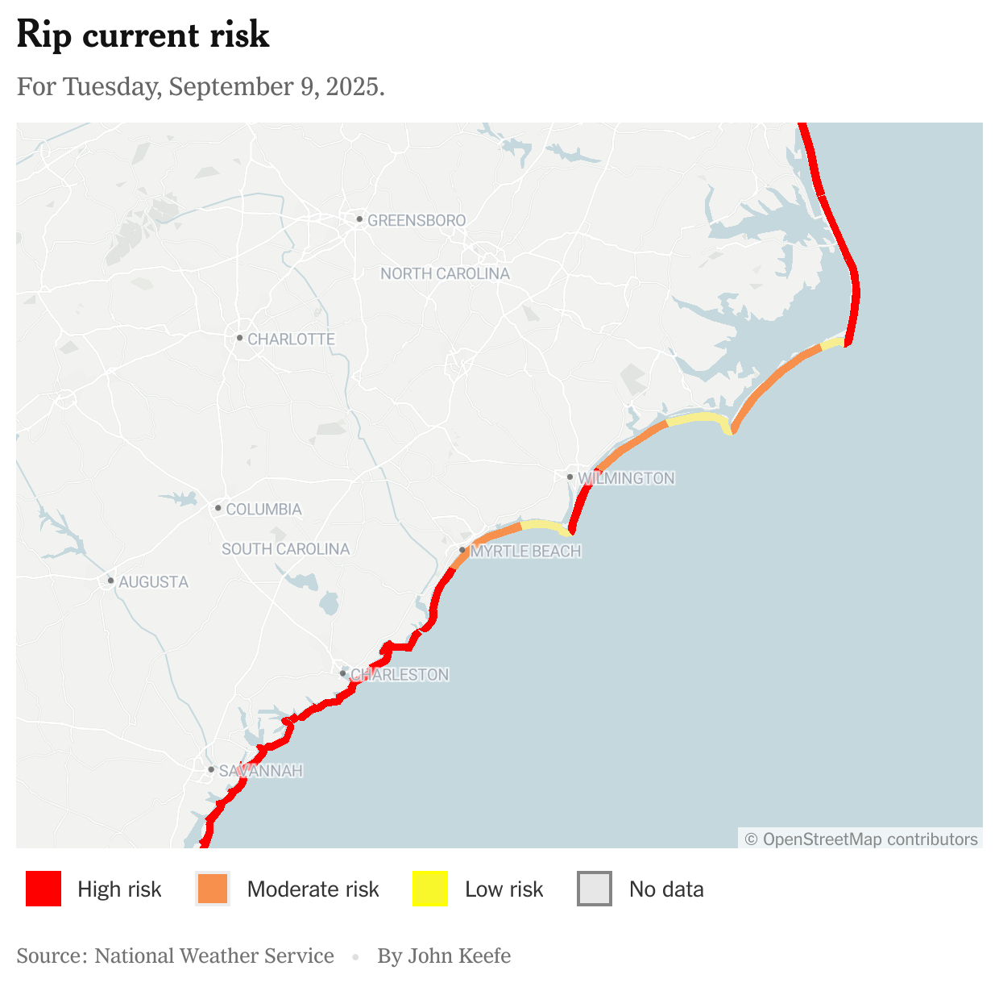

# Understanding and Using Hurricane Data

_Information to accompany my presentation at the Online News Association's ONA25 conference in New Orleans on September 10, 2025._

## There's a new hurricane. Now what?

Expect lots of interest, before it ever reaches land.

- Where is it going?
- When might it get here?
- How strong will it become?
- Where it is now?
- What hazards are ahead?

Also, maybe:

- Where it's been?
- What other storms have hit the area?

## Current Tracking Data

- National Hurricane Center [main page](https://www.nhc.noaa.gov/)
- NHC's [geospatial data archive](https://www.nhc.noaa.gov/gis/), which includes the path, wind speed and other files for active storms.
- The [CurrentStorms](https://www.nhc.noaa.gov/CurrentStorms.json) json file.
- Example NHC data in this repository's [examples/kiko](examples/kiko) folder.
- `wsp34knt120hr_5km.shp`: the 5-day chances of 34-knot (tropical storm) winds
- `wsp50knt120hr_5km.shp`: the 5-day chances of 50-knot ("damaging") winds
- `wsp50knt120hr_5km.shp`: the 5-day chances of 64-knot (hurricane-force) winds
- `5day_pts.shp`: the 5-day prediction of location and strength
- `5day_lin.shp`: 5-day "path" (really just connecting the points)
- Items in the "best track" folder are detail of where the storm _already has been_

### Model tracks, strengths and other storm details

- Tomer Burg's [tropical cyclone pages](https://www.polarwx/tropical/)
- Model tracks from the University of Wisconsin-Milwaukee are at `https://web.uwm.edu/hurricane-models/models/{stormId}.kml` where `stormId` is a Hurricane Center ID in lower case like `ep112025`.

### New NHC Data Products

#### Warnings by county

During an active hurricane threatening the U.S., the hurricane center provides maps of watches and warnings by county, not just the shorelines.

#### Rip currents

Main [website](https://www.nhc.noaa.gov/templates/graphics_ripCurrents_inc.shtml) and latest map.

- Latest [data](https://www.nhc.noaa.gov/gis/rip_currents/rip_currents_composite_latest.geojson) (geojson)
- [One-day](https://www.nhc.noaa.gov/gis/rip_currents/rip_currents_day1_latest.geojson) forecast
- [Two-day](https://www.nhc.noaa.gov/gis/rip_currents/rip_currents_day2_latest.geojson) forecast

Pause to show how to very quickly make a current rip-currents map with Datawrapper.

## Satellite images & loops

[The "Slider"](https://rammb-slider.cira.colostate.edu/) from Colorado State University.

## Previous Storms

For those times when you (or an editor) want to know "which storms have hit this area before?"

### Hurricane tracks archive

Caution: This site gets _very slow_ during big hurricanes, especially close to landfall. Get your data here early.

- Historical hurricane tracks [site](https://coast.noaa.gov/hurricanes/#map=4/32/-80)
- Here, I've selected major hurricanes (Category 3, 4 and 5) that [made landfall near New Orleans](https://coast.noaa.gov/hurricanes/#map=7.24/29.864/-89.931&search=eyJzZWFyY2hTdHJpbmciOiJOZXcgT3JsZWFucywgT3JsZWFucyBQYXJpc2gsIExvdWlzaWFuYSwgVVNBIiwic2VhcmNoVHlwZSI6Imdlb2NvZGVkIiwib3NtSUQiOiIxMzE4ODUiLCJjYXRlZ29yaWVzIjpbIkg1IiwiSDQiLCJIMyJdLCJ5ZWFycyI6W10sIm1vbnRocyI6W10sImVuc28iOltdLCJwcmVzc3VyZSI6eyJyYW5nZSI6WzAsMTAzMF0sImluY2x1ZGVVbmtub3duUHJlc3N1cmUiOnRydWV9LCJ0YWJJbmRleCI6MSwiYnVmZmVyIjo2MCwiYnVmZmVyVW5pdCI6WyJOYXV0aWNhbCBNaWxlcyJdLCJzb3J0U2VsZWN0aW9uIjp7InZhbHVlIjoieWVhcnNfbmV3ZXN0IiwibGFiZWwiOiJZZWFyIChOZXdlc3QpIn0sImFwcGx5VG9BT0kiOnRydWUsImlzU3Rvcm1MYWJlbHNWaXNpYmxlIjp0cnVlfQ==)

Important note! This system will only show hurricanes that were one of those categories _while within the circle of interest_. For example, Katrina was a Category 5 hurricane earlier in its existence in the Gulf, but was a Category 3 at landfall so it doesn't appear in this:

- [Category 5 hurricanes](https://coast.noaa.gov/hurricanes/#map=7.24/29.864/-89.931&search=eyJzZWFyY2hTdHJpbmciOiJOZXcgT3JsZWFucywgT3JsZWFucyBQYXJpc2gsIExvdWlzaWFuYSwgVVNBIiwic2VhcmNoVHlwZSI6Imdlb2NvZGVkIiwib3NtSUQiOiIxMzE4ODUiLCJjYXRlZ29yaWVzIjpbIkg1Il0sInllYXJzIjpbXSwibW9udGhzIjpbXSwiZW5zbyI6W10sInByZXNzdXJlIjp7InJhbmdlIjpbMCwxMDMwXSwiaW5jbHVkZVVua25vd25QcmVzc3VyZSI6dHJ1ZX0sInRhYkluZGV4IjoxLCJidWZmZXIiOjYwLCJidWZmZXJVbml0IjpbIk5hdXRpY2FsIE1pbGVzIl0sInNvcnRTZWxlY3Rpb24iOnsidmFsdWUiOiJ5ZWFyc19uZXdlc3QiLCJsYWJlbCI6IlllYXIgKE5ld2VzdCkifSwiYXBwbHlUb0FPSSI6dHJ1ZSwiaXNTdG9ybUxhYmVsc1Zpc2libGUiOnRydWV9) that made landfall near New Orleans (really: hurricanes that were Category 5 near New Orleans)

### NHC data archive

All of the cone, track, wind speed and other geospatial data files for previous storms.

- NHC's [geospatial data archive](https://www.nhc.noaa.gov/gis/)

### Model archive

- [Model tracks](https://web.uwm.edu/hurricane-models/models/archive/) from the University of Wisconsin-Milwaukee

## Making maps in Datawrapper

### Rip-current map

- Download the current rip-current data:
  - Go to [bit.ly/rip-current-data](https://bit.ly/rip-current-data) (aka www.nhc.noaa.gov/gis/rip_currents/rip_currents_composite_latest.geojson)
  - Right-click on what your browser shows and save that file as `ripdata.json`
  - Go to [Datawrapper](https://www.datawrapper.de/)
  - Log in or make a free account
  - Click on Dashboard
  - Pick Create new ... Map
  - Pick Locator map
  - Toggle the "Import line and area markers" switch
  - Drag your `ripdata.json` file to the white "Drop or paste" box
  - Click on "Area Marker 1" and make its fill opacity 100% and turn off outline
  - Drag "Area Marker 3" above "Area Marker 2" and make its color Orange (instead of yellow) and fill opacity 100% and turn off outline
  - Click on "Area Marker 2" and make its color yellow and fill opacity 100% and turn off outline
  - On the map, zoom into someplace on the U.S. East Coast
  - Click on Annotate and Layout at the top
  - Toggle on the "Show Key" switch
  - Pick "List"
  - Rename the legend items
  - Cross-check against the high/low/moderate zones [here](https://www.nhc.noaa.gov/templates/graphics_ripCurrents_inc.shtml), remembering that we've changed yellow to orange and gray to yellow

### Track and wind map

I made the this map using Datawrapper, Mapshaper.org and the files in the [examples](examples/kiko) folder here.

#### Building the damaging winds file

Note that these files start as "shapefiles," which are actually a collection of files. To make sure Mapshaper gets all the data it needs, be sure to select all of the shape's files (they all have the same name, with different extentions), and drag them together into Mapshaper:

- Opened [mapshaper.org](https://mapshaper.org)
- Dragged all of the `_wsp50knt120hr_5km` files from the example folder Mapshaper to the main window
- Added `pct` value to each band (using lowest value available)
  - You do this by inspecting the area and then using the "edit" button in the little window
- Opened console with the Console button
- Typed `-classify pct colors=Oranges breaks=20,40,60,80`
- Typed `-style stroke-width=0`
- Used the Export button
- Saved as Geojson

#### Building the forecast points file

- Reload [mapshaper.org](https://mapshaper.org)
- Dragged all of the `_5day_pts` files to the main window
- Want to [style the markers](https://academy.datawrapper.de/article/177-how-to-style-your-markers-before-importing-them-to-datawrapper) for Datawrapper ahead of time
- Opened console with the Console button
- Typed `-each "name=DATELBL"`
- Typed `-each "markerSymbol=SSNUM"`
- Used the Export button
- Saved as Geojson

#### Building in Datawrapper

- Signed in
- New locator map
- Toggle "Import line and area markers" switch
- Dragged in the damaging winds geojson
- Dragged in the forecast points geojson
- Tinkered with the styles, including:
  - Made the areas 100% opacity
  - Changed the circles for the tropical storm points to little dots
  - Added carrage returns to the time/day labels
  - Added "Hurricane Kiko" as the first label
  - Added "Hawaii" as a label by searching for it in the box
  - Tinkered with the Hawaii text and formatting
- In "Annotate & Layout":

  - Toggled "Show key"
  - Added a title
  - Changed position to "Top"
  - Deleted the point icons
  - Re-labeled the area colors

## Using "Tropycal" in Python for deeper analysis

The Google Collab notebook I showed in the session can be viewed (and copied) [here](https://colab.research.google.com/drive/1G3JROO5XqGNeOSDzw3rTmPju-DdPjuua?usp=sharing) or via the bitly link [bit.ly/hurricane-data-python](https://bit.ly/hurricane-data-python).

Also, for reference, the Jupyter Notebook code is in the examples directory [here](examples/Hurricane_Data_Demo.ipynb).

- [General documentation](https://tropycal.github.io/tropycal/index.html)
- [Example documentation](https://tropycal.github.io/tropycal/samples/tracks.storm.html)
- [Model plot documentation](https://tropycal.github.io/tropycal/api/generated/tropycal.realtime.RealtimeStorm.plot_ensembles.html)

## NYT tracker pages

- Hurricane [Erin 2025](https://www.nytimes.com/interactive/2025/weather/hurricane-erin-map-path-tracker.html)
- Hurriane [Helene 2024](https://www.nytimes.com/interactive/2024/09/24/weather/helene-map-path-tracker.html)

## Tips & Best Practices

### Basics

- _tropical disturbances_ — clusters of storms
- _tropical depressions_ — more organized; sustained winds of 38 miles per hour; National Hurricane Center begins issuing advisories
- _tropical storms_ — sustained winds of 39 m.p.h. or more; it gets a name
- _hurricanes_ — sustained winds at 74 m.p.h. or more
- _major hurricanes_ — sustained winds at least 111 m.p.h., making it a Category 3 or higher

### Landfall

When the _center_ of the storm — which is the center of the eye — reaches land. (Not when the eyewall reaches land.)

### Long-range track predictions

Hurricane experts repeatedly tell us that, at this point, any notion of where a hurricane will be more than 7 days out is not valid.
