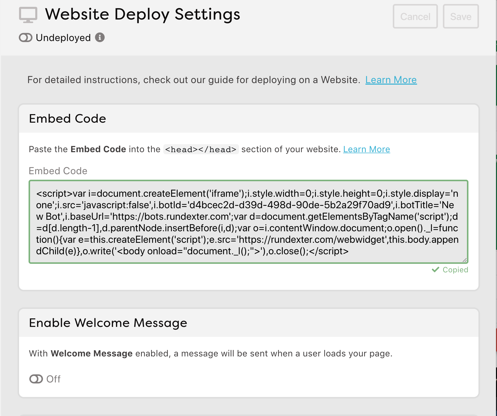

# Make a button bot

## Publish your bot

To get this ready to share, click the green "Publish Topic" button.

## Put it on the web

Dexter is great about walking you through this entire process, under the "Platforms" button. 

- To start, click on the "Platforms" button.
- Choose Website.
- Click the large block of code in the middle of the screen. It'll get copied to the clipboard.



We're going to put this code onto the web using a paste service. 

- Go to [pste.eu](http://pste.eu).
- Click into the big box.
- Paste the code into the box.
- Hit "Submit"
- You'll get private link. Click it!
- It looks like you now have a blank screen, but click the icon in the lower-right corner.
- Your chat bot will appear!
- Try it!

## Adding fun features

You can -- and should -- guide your user's path by providing buttons, which show up really nicely in Facebook. Here's how:

- Tip! You can insert buttons, links, images, and more using the "+Insert" button at the top of the editing window.

Add buttons ...

```
+ hi
- I'm a bot that can answer your questions about Star Island. What 
would you like to know about? ^buttons(Location, Getting There, What's on Star)
```

Revise the triggers to match the buttons. Clicking a button is as if the user has _typed_ the words in that button. (Remember: No punctuation in your triggers!)

```
+ whats on star
- There's a big, old hotel. Also a marine lab, some tennis courts, an old stone chapel and a historical museum. Also lots of seagulls!
```

You can also add a link!

```
+ location
- It's 10 miles off the coast of Portsmouth, New Hampshire. ^link("https://goo.gl/maps/T5qxWXTXLLF2","Star Island Map")
```

Add a picture ...

```
+ getting there
- There are many boats that make regular trips from Portsmouth, New Hampshire. ... like the Thomas Laighton ^image("http://media.johnkeefe.net/class-modules/boat.jpg")
```

These "shortcuts" -- what Dexter calls the commands that start with a carrot `^` aren't something you have to memorize. They're also available in the bar above your bot script by clicking "+ Insert."

You can also use buttons to provide better help ...

```
+ [*] help [*]
- Here are the things I know how to do. Just pick one! ^buttons(Location, Getting There, What's on Star)
```

## Routing

Here's a new RiveScript feature for you: Routing the user to another trigger.

Our bot really only answers three questions. So it might make sense to provide buttons to those three things after every question.

One way to do that would be to provide the button code -- `^buttons(Location, Getting There, What's on Star)` -- after every answer, like so:

```
+ location
- It's 10 miles off the coast of Portsmouth, New Hampshire. ^link("https://goo.gl/maps/T5qxWXTXLLF2","Star Island Map") ^buttons(Location, Getting There, What's on Star)
```

That would certainly work. But there's a more efficient way. Let's make _one_ button trigger:

```
+ my buttons
+ ^buttons(Location, Getting There, What's on Star)
```

And then _route_ the user to that trigger after every option. We do that with the `{@ trigger}` notation, like so:

```
+ hi
- I'm a bot that can answer your questions about Star Island. What 
would you like to know about? {@ my buttons}

+ location
- It's 10 miles off the coast of Portsmouth, New Hampshire. ^link("https://goo.gl/maps/T5qxWXTXLLF2","Star Island Map") {@ my buttons}

+ getting there
- There are many boats that make regular trips from Portsmouth, New Hampshire. ... like the Thomas Laighton ^image("http://media.johnkeefe.net/class-modules/boat.jpg") {@ my buttons}

+ whats on star
- There's a big, old hotel. Also a marine lab, some tennis courts, an old stone chapel and a historical museum. Also lots of seagulls! {@ my buttons}

+ [*] help [*]
- Here are the things I know how to do. Just pick one! {@ my buttons}
```

This may seem silly, but it solves two things: You don't repeat yourself (which coders call _DRY_ code) as much, and if you happened to add a fourth or fifth option, you'd just change one line instead of several.

## Share it with others

You can allow other people to try your bot by giving them your _pste.eu_ link. 

(Also you may want to bookmark it at this point.)