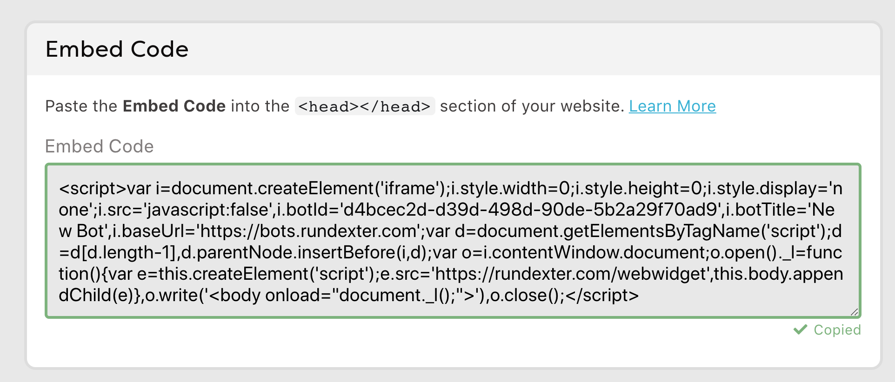
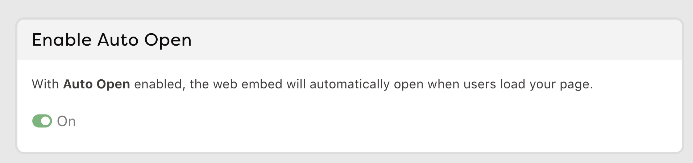
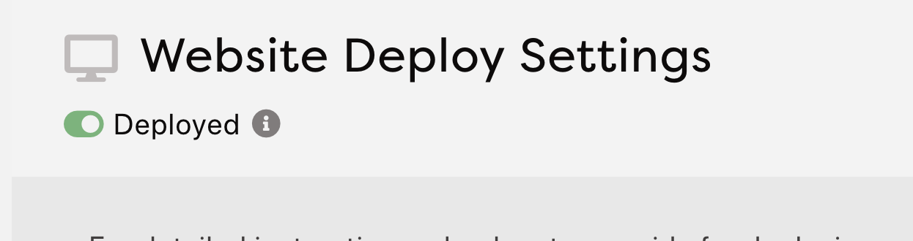

# Build a Chatbot

## NOTE: Looking for Messenger Bots?

**This module originally described building a Facebook Messenger bot. But there's an easier way to get started, which this now outlines. If you're intent on building a Facebook Messenger Bot, head over to the [messenger bot module](../module-messenger-bot).** 

## Introduction

- Shortcut to this page: [jkef.me/build-web-bot](http://jkef.me/build-web-bot)
- We're going to make an "Ask me Anything" bot. Think about what you might make a bot to answer about. It should be something you know well. Could be about your project, the project's topic, your company, your favorite book, your favorite place, or you
- Your bot will eventually become public, so no secret stuff

## The Bot Engine

There are LOTS of bot engines out there, and we're going to use [Dexter](https://rundexter.com), which is what we use for chatbots at Quartz. Dexter is free up to 100 users, so good for experimenting. For bigger projects, check out the [Dexter pricing here](https://rundexter.com/pricing).

- Go to [rundexter.com](http://rundexter.com)
- Make an account
- Click "Make your first bot" button (or something similar)
- Enter your info
- Pick a password
- Click "Sign up for free"
- Click the green "+" button.
- For theme, Click "Blank Project"
- Click "Create Bot"
- Clear out what appears in the center window (we'll start from scratch for real)

## Basics

- Using a language called RiveScript

- `+` is what the human says ... the trigger
- `-` is what the bot says ... the response
- Note there's a space after the `+` or `-`

Let's start out with a good introductory phrase. Let people know right away what they'll get from this bot.

```
+ hi
- I'm a bot that can answer your questions about Star Island. Ask 
me anything!
```
- Try it in the demo phone!
- Note that if you can't see the demo phone, you may need to scroll down.

## Simple Question and Answer

Come up with three questions a human might ask your bot, once that human knows what your bot is about.

- Make all the human questions (the triggers, or `+` lines ) **lowercase**
- In the human questions (triggers,  or `+` lines) **don't use punctuation**
- Put a blank line between each set. See below.
- Test your questions in the demo phone as you go.

```
+ where is star island
- It's 10 miles off the coast of Portsmouth, New Hampshire.

+ how do you get there
- Once you get yourself to Portsmouth, you can take one of the
boats that make regular trips.

+ whats on star island
- There's a big, old hotel. Also a marine lab, some tennis courts,
 an old stone chapel and a historical museum. Also lots of seagulls! 
 They're loud and think they own the island. But pretty harmless 
 otherwise. If you go hiking on the rocks away from the hotel, 
 tho, stay away from the small, gray ones. Parent gulls have 
 been known to attack people to protect their young! 😯
```

- Try it! Now we can test our bot in the "phone" that's on the side of the screen. Try typing your questions. They must be exact.

### A little help

Using a `*` means "anything" and [brackets] means it's optional. So here's a smart way to catch anyone saying the word "help" (with anything or nothing before or after "help"):

```
+ [*] help [*]
- Just type a question, and I'll give it my best shot.
```

Also, we probably want to say something nice when there is no match. You can use the "catchall" to match anything that hasn't already matched.

```
+ *
- I'm sorry, I don't understand what you said.
- If that's a question, I don't know the answer yet.
- Ooof. I don't understand. Maybe try asking in another way.
```

Another nice trick is to add multiple `-` lines. Dexter will randomly pick from among them to reply.

## Publish your bot

To get this ready to share, click the green "Publish Current Topic" buttons.

## Put it on the web

Dexter is great about walking you through this entire process. 

- To start, click on little paper airplane at the top of the screen.
- Click the "Get Started" button.
- Click the large block of code, called the "Embed Code," in the middle of the screen. It'll get copied to the clipboard.



- Scroll down and flip the little switch under "Enable Auto Open."



- Scroll up and flip the little switch at the top from "Undeployed" to "Deployed."



We're going to put this code onto the web using a paste service. 

- Go to [pste.eu](http://pste.eu).
- Click into the big box.
- Paste the code from your clipboard into the box.
- Hit "Submit"
- You'll get private link. Click it!
- Your chat bot will appear!
- Try it!

## Adding fun features

You can -- and should -- guide your user's path by providing buttons, which show up really nicely in Facebook. Here's how:

- Tip! You can insert buttons, links, images, and more using the gray icons atop the editing window.

Add buttons ...

```
+ hi
- I'm a bot that can answer your questions about Star Island. What 
would you like to know about? ^buttons(Location, Getting There, What's on Star)
```

**Important note:** For the buttons to work, their names must match triggers elsewhere in the script! And those triggers, like all triggers, must be all lowercase and contain no punctuation. Someone clicking a button is actually treated as through they had _typed_ the words inside the button.

Add a link ...

```
+ location
- It's 10 miles off the coast of Portsmouth, New Hampshire. ^link("https://goo.gl/maps/T5qxWXTXLLF2","Star Island Map")
```

Add a picture ...

```
+ getting there
- Once you get yourself to Portsmouth, you can take one of the
boats that make regular trips ... like the Thomas Laighton ^image("http://media.johnkeefe.net/class-modules/boat.jpg")
```

Add chat timing ... adding `<delay seconds=2>` to break up a long line of text into separate chat bubbles.

```
+ whats on star
- There's a big, old hotel. Also a marine lab, some tennis courts,
 an old stone chapel and a historical museum.<delay seconds=2>Also lots of seagulls!<delay seconds=2>They're loud think they own the island. But pretty harmless otherwise. <delay seconds=2> If you go hiking on the rocks away 
 from the hotel, tho, stay away from the small, gray ones. <delay seconds=2>
 Parent gulls have been known to attack people to protect their young!<delay seconds=2>😯
```

And better help ...

```
+ [*] help [*]
- Here are the things I know how to do. Just pick one! ^buttons(Location, Getting There, What's on Star)
```

## Share it with others

You can allow other people to try your bot by giving them your _pste.eu_ link. 

(Also you may want to bookmark it at this point.)

## Pursuing more

- Dexter documentation is really good
- Read more about [RiveScript](https://www.rivescript.com/docs/tutorial), the language Dexter uses. (Most, but not all, RiveScript features are available in Dexter.)
- If you'd like to add language recognition -- so triggers don't have to be typed exactly -- check out my [workshop on adding natural language processing](https://github.com/jkeefe/workshops/tree/master/module-chatbot-add-nlp).


