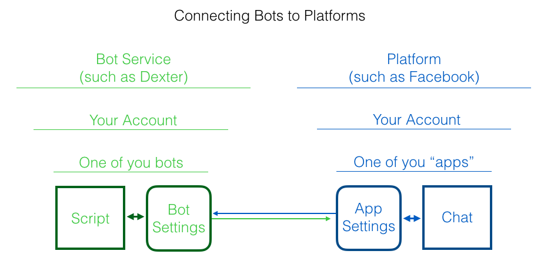

# Build a Chatbot

## Introduction

- We're going to make an "Ask me Anything" bot
- Could be about your project, something you know a lot about, or you
- Since we're going to be playing with this information, and it could become public, no secret stuff
- I'll show you how to add it to facebook ... in a bit

## The Bot Engine

- Facebook is only the interface
- There are LOTS of bot engines out there
- (See the post on our Quartz [bot blog](https://bots.qz.com) for a bunch of them.)
- We're going to use [Dexter](https://rundexter.com)
- Made for writers. (Point-and-click isn't.)
- Go there and make an account
    - Click "Make your first bot" button (or something similar)
    - Enter your email
    - Pick a password
    - Click "Signup"
    - https://rundexter.com/pricing 
    - $0 for up to 100 users
- Click the blue "+ New Bot" button.
- Click "Blank Project"
- Click "Create Bot"
- Name it as you wish
- Clear what's there (we'll start from scratch for real)

## Kickoff Welcome

- "get started"
- Using a language called `RiveScript`

```
+ get started
- I'm a bot that can answer your questions about Star Island. Ask 
me anything!
```

## Simple Question and Answer

- `+` is what the human says
- `-` is what the bot says

```
+ Where is Star Island?
- It's 10 miles off the coast of Portsmouth, New Hampshire.
```

```
+ How do you get there?
- Once you get yourself to Portsmouth, you can take one of the
boats that make regular trips.
```

```
+ What's on Star Island?
- There's a big, old hotel. Also a marine lab, some tennis courts,
 an old stone chapel and a historical museum. Also lots of seagulls!
```

- Try writing 3-4 questions yourself
- [Writing pause!]
- Next ... delete all the punctuation in your questions!
    - Dexter ignores it all, and it can cause confusion
- Also capitalization doesn't matter.
- Try it! Now we can test our bot in the "phone" that's on the side of the screen. Try typing your questions.

## Fuzzy matching

Because Dexter is looking for exact matches, there are lots of questions our bots won't answer
    - Where is it?
    - What's its location?
    - What can you do there?
    
### Anticipating options:

Group options in parentheses, separated by the `|` symbol (on Macs, it's shift-backslash, over the return key).

```
+ where is (star island|it|the island)
- It's 10 miles off the coast of Portsmouth, New Hampshire.
```

Even ...

```
+ (where is|wheres) (star island|it|the island)
- It's 10 miles off the coast of Portsmouth, New Hampshire.
```

### Anticipating _anything_:

```
+ (where is|wheres) *
```

... matches anything that starts with "Where's" or "Where is," followed by some text.

### Anticipating seagulls:

Say we want to respond to the word "seagulls" no matter if there's text before or after it. `* seagulls *` won't work, because the bot will  only respond if there's something before and after the word, like "Tell me about seagulls on the island." "Tell me about seagulls" won't match.

So use brackets `[]` to denote optional things:

```
+ [*] seagulls [*]
- They're loud think they own the island. But pretty harmless 
otherwise. If you go hiking on the rocks away from the hotel, tho, 
stay away from the small, gray ones. Parent gulls have been known 
to attack people to protect their young! 😯
```

### A little help

Using brackets, as in the seagull example, is a smart way to catch anyone needing help, too: 

```
+ [*] help [*]
- Just type a question, and I'll give it my best shot.
```

Also, we probably want to say something nice when we don't understand a question. You can use the "catchall" to match anything that hasn't already matched.

Another nice trick is to add multiple `-` lines. Dexter will randomly pick from among them to reply.

```
+ *
- I'm sorry, I don't understand what you said.
- If that's a question, I don't know the answer yet.
- Ooof. I don't understand. Maybe try asking in another way.
```

## Wire up to Facebook

Dexter is great about walking you through this entire process, under the "Platforms" button. 

- To start, click on the "Platforms" button.
- Choose Facebook.

### Setting up your Facebook Page

In Facebook, bots live on "pages" you add to your profile.

- You'll need a Facebook account (look on with someone if you don't have one)
- Open a new browser tab and log in to [Facebook](https://facebook.com)
- To make the page ...
   - Go to https://www.facebook.com/pages/create/
   - Make your new page. Don't worry about the pretty details, you can add them later.
   - Once it's made, look in the left column for "About" (you may need to click "see more"). Click on "About"
   - Scroll all the bottom
   - Highlight and copy the "Page Id"
   - Go back to the Dexter tab
- Paste the ID number into the box
- Click "Next"

### Setting up your Facebook Bot App

This is a very typical setup: The bot you make needs to connect to a new "app" in the platform you are using, such as Facebook.



The part missing so far is the platform app. To make an app in Facebook, you need to register as a Facebook developer.

- Go to Facebook [developer portal](https://developers.facebook.com/apps/) and follow the instructions.  

After you are registered as a Facebook developer we need to make that app and then make a connection between the bot settings and the app settings.

- Click "Create New App"
- Give it a name
- Click on the "settings" at the side
- On the **Facebook** tab
    - Copy App ID 
- On the **Dexter** tab
    - Paste App ID paste into box
- On the **Facebook** tab 
    - Get App Secret (you may have to confirm your password)
- On the **Dexter** tab
    - Paste into Dexter 
- Back at the **Facebook** tab ...
    - App Domains, put `rundexter.com`
    - Click "Add Platform" at the bottom
    - Make the site url `https://rundexter.com`
    - CLICK SAVE CHANGES
- Back to the **Dexter** tab
    - Click Next
    - Click Authenticate
    - Agree
    - Click Next
    - Click Deploy
    - Click Next
- Go to your bot! (Click the link in Dexter)
    - mine is http://m.me/147365322486738
    
Whew!

## Better flow

For long answers, you can add "natural" pauses with `<chat>`

```
+ [*] seagulls [*]
- They're loud think they own the island. <chat>But pretty harmless 
otherwise. <chat>If you go hiking on the rocks away from the hotel, 
tho, stay away from the small, gray ones. <chat>Parent gulls have 
been known to attack people to protect their young! <chat>😯
```

## Adding fun features

You can encourage your user's path by providing buttons, which show up really nicely in Facebook. Here's how:

```
+ get started
- I'm a bot that can answer your questions about Star Island. What 
would you like to know about? ^buttons("Location", "Activities", "Getting There")
```

```
+ location
- It's 10 miles off the coast of Portsmouth, New Hampshire. <chat>Here's
 a link to a map: ^link("https://goo.gl/maps/T5qxWXTXLLF2","Star Island Map")
```

```
+ activities
- The island is host to family conferences, day visitors, and 
an annual sailboat race.
```

```
+ getting there
- The trip aboard the Thomas Leighton takes about an hour from Portsmouth. ^image("http://media.johnkeefe.net/class-modules/boat.jpg")
```

- Tip! You can insert buttons, links, images, and more using the "+Insert" button at the top of the editing window.

## Make it Public

- Go back to that Facebook tab
- Click "App Review" in the sidebar
- Click the big "Make [bot name] Public" switch
- Some things require review, like broadcasting and ads

## Adding Natural Language Processing

### Introduction to API.ai

There are lots of tools out there to use. We'll play with [API.ai](https://api.ai).

### Setup

As usual, you'll need to sign up. It's free. And you'll need a Google/Gmail account.

- Click "Sign up for Free"
- Log in with Google (API.ai is a Google product now)
- In the sidebar, chose "Prebuilt Agents"
- Then in the main area, find the logo for the "Small Talk" prebuilt agent (Note, this is _not_ the "Small Talk" option in the left-side menu)
- Just leave the "Link to Google Project" line empty and hit OK
- Wait and then click "Proceed to Agent"
- This is tricky ... now in the _drop-down_ menu, chose "Small-Talk." Again, not the "Small Talk" item that's always in the sidebar. Look for the hyphen in `Small-Talk`. That's the right one.
- Now, to end this craziness, let's rename it. Click the gear next to `Small-Talk` (with the hyphen)
- Call it "My-Workshop-Bot"
- Click "Save"

### Play a little

Find the "Try it now" box at the top and try typing some random phrases that might constitute small talk. What happens?

Pay close attention to the "Intent" and "Action" areas.

Also try things that might be casual synonyms for "yes" and "no."

### Connect it to your Dexter Bot

- On the API.ai settings page, copy the "Client Access Token"
- Switch to your Dexter bot
- Paste the "Client Access Token" at the very top of your bot script.
- In front of the token, add `! var apiai = Bearer ` so it looks something this:

```
! var apiai = Bearer ab12cd34ef56ab78cd90ef12
```

- Copy the code below and paste it to the bottom of your bot script:

```
+ *
$ GET https://api.api.ai/v1/query?v=20150910&query=<call>encode_uri <star></call>&lang=en&sessionId=<_platformId> {"headers":{"Content-Type":"application/json", "Authorization": "<bot apiai>"}}
- The action I detect is: ${{result.action}}

> object encode_uri javascript
    return encodeURIComponent(args[0])
< object
```

- OK! Now try saying some things into the sample phone on the Dexter console.

### Handle calls for help

Let's be sure that whenever someone says help, they get a kind response:

```
+ help
- I'm sorry you're having trouble!
- I'll try to get you some help!
```

Try it in the phone simulator!

But what about "Can you assist me?" For that, let's handle anything the natural language thinks is a call for help, or `smalltalk.agent.can_you_help`.

- Copy this line ...

```
* ${{result.action}} == smalltalk.agent.can_you_help => {@ help}
```

- ... and paste it in your "catchall" trigger as the second-to-last line. Like this:

`+ *
$ GET https://api.api.ai/v1/query?v=20150910&query=<call>encode_uri <star></call>&lang=en&sessionId=<_platformId> {"headers":{"Content-Type":"application/json", "Authorization": "<bot apiai>"}}
* ${{result.action}} == smalltalk.agent.can_you_help => {@ help}
- The action I detect is: ${{result.action}}
```

We've added an "if-then" statement to the block. It says: If `${{result.action}}` is equal to `smalltalk.agent.can_you_help` then go to a `help` trigger.

See it there?

Try it!


## Pursuing more

- Dexter documentation is really good
- Read more about [RiveScript](https://www.rivescript.com/docs/tutorial), the language Dexter uses. (Most, but not all, RiveScript features are available in Dexter.)
- Natural Language Processing


